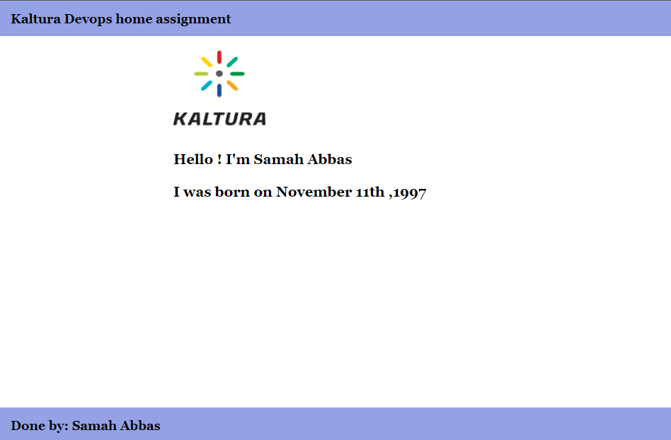

# Kaltura Task

## Objective  
Build and deliver a simple nginx stack based on k8s

______________________________________________

## Requirements: 
1. Please create CI as following:

    - Create docker file, consist of nginx
    - the nginx need to publish your name and DOB as plain text
    - Please create a script to build and push the dockerfile in to Dockerhub

2. add deployment based on k8s yaml. 

	- the k8s deployment needs to utilize the nginx image built on the first phase.
	- We should reach the nginx from our computer browser using port 80

______________________________________________

## Required:

1. #### You need to set kubernetes cluster:

	  - You can set minikube (instructions  are in the link : https://minikube.sigs.k8s.io/docs/start/ ) , OR...

	  - If you have docker desktop on your computer, enable kubernetes (https://docs.docker.com/desktop/kubernetes/) (Latest versions)

2. #### You need to install the nginx ingress-controller:
	There are multiple ways to install the NGINX ingress controller: - with Helm, using the project repository chart; - with kubectl apply, using YAML manifests;
	- if you use minikube:
		The ingress controller can be installed through minikube's addons system:
		```
		minikube addons enable ingress 
		```
	- if you use kubernetes of docker desktop:
		The ingress controller can be installed through :
		```
		kubectl apply -f https://raw.githubusercontent.com/kubernetes/ingress-nginx/controller-v1.1.0/deploy/static/provider/cloud/deploy.yaml 
		```
		OR with helm (requires Helm version 3) :
		
		```
		helm upgrade --install ingress-nginx ingress-nginx --repo https://kubernetes.github.io/ingress-nginx --namespace ingress-nginx --create-namespace
 		 ```
	
 	 (full instructions in the link : https://kubernetes.github.io/ingress-nginx/deploy/#docker-desktop )

______________________________________________
 
 #### * I didn't use minikube, because there is no enough space on my pc to install it . So I used the kubernetes of Docker desktop which is already installed on my computer.


______________________________________________

## In order to build & run:

#### First you need to clone the code:
```
git clone https://github.com/samahAbbas11/Kaltura_Task.git
cd Kaltura_Task
```

#### To run the deployment:
```
kubectl apply -f deployment.yaml
```

#### run ingress file :
```
kubectl apply -f ingress.yaml
```

#### Then you can access the service using the URL: http://localhost/
you'll see :




______________________________________________

## Solution explanation:
- ### Created a simple HTML file, named index.html , in order to present name & DOB. 
- ### Created Dockerfile :
   - For importing nginx image from dockerhub ( https://hub.docker.com/_/nginx )
   - Copy html file from the current dir to the nginx image
-  ### Created Jenkinsfile to build docker image and push it to Dockerhub :
   - The Jenkinsfile consists of Jenkins Pipeline ( cloning the project + build image + login to dockerhub +  push image)
   - In order to login to docker hub from jenkins I've created a new credential with my Docker Hub account details. 
   - created pipeline job in jenkins master
   - import Jenkinsfile from the git repo
      
   - Dockerhub repo 
      
      
- ### Deployment based on k8s yaml :
   - Created yaml file named : deployment.yaml with service exposed by specifying a type in the ServiceSpec: ClusterIP (default) - (Exposes the Service on an internal IP in the cluster. This type makes the Service only reachable from within the cluster). and with port: 80 , targetPort: 80.
   - Then Createed an Ingress yaml file  (with path : / , by default the host is : localhost and with port 80 ), which runs on the same service of the deployment.
   Because Ingress is an object that allows access to Kubernetes services from outside the Kubernetes cluster, so after applyin the ingress.yaml , we can access the html file from outside the kubernetes cluster. (For more information: https://www.nginx.com/resources/glossary/kubernetes-ingress-controller/ )
   - Then applying the yaml files (deployment + ingress) ( As mentioned earlier at  " In order to build & run" section )


